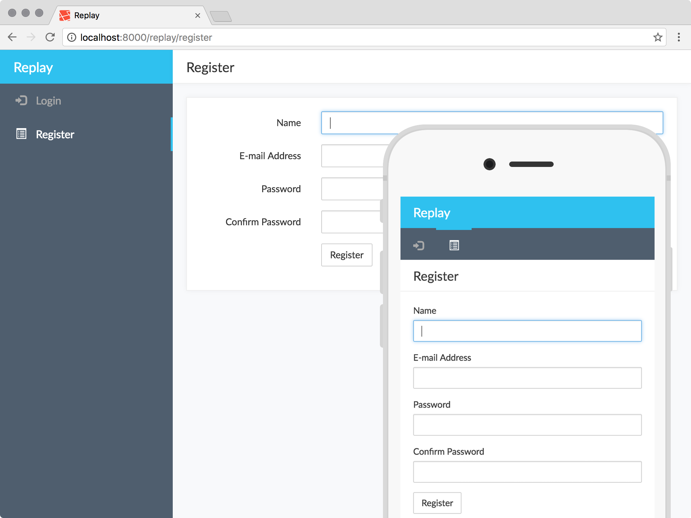

## Getting Started

```
cd path/to/project
composer require replay/auth
composer require replay/theme
```

Add service providers to `config/app.php`:

```php
"providers" => [
    // ...other service providers,
    \Replay\Auth\AuthProvider::class,
    \Replay\Theme\ThemeProvider::class,
]
```

Migrate database and install modules:

```
php artisan migrate
php artisan replay-auth:install
php artisan replay-theme:install
```

## Documentation

1. [Getting Started (more details)](docs/getting-started.md)
2. [Testing](docs/testing.md)
3. [Theming](docs/theming.md)
4. [Configuring](docs/configuring.md)

## License

This package is released under a dual GPL-3/proprietary license. That means you can use it for free, as long as you adhere to the GPL-3 license. If you do not want to adhere to the GPL-3 license, [contact me](https://twitter.com/assertchris) to purchase a proprietary license.

## Support

This package currently supports any minor version of Laravel `5.3`. I'll do my best to upgrade it following the release of new major/minor versions.

## Versioning

This library follows [Semver](http://semver.org). According to Semver, you will be able to upgrade to any minor or patch version of this library without any breaking changes to the public API. Semver also requires that we clearly define the public API for this library.

All methods, with `public` visibility, are part of the public API. All other methods are not part of the public API. Where possible, we'll try to keep `protected` methods backwards-compatible in minor/patch versions, but if you're overriding methods then please test your work before upgrading.
